# ZenAI Questions - Application Architecture

## Overview

ZenAI Questions is a **RAG (Retrieval-Augmented Generation)** application built with Next.js 16 and React 19. It provides intelligent document search, knowledge management, and pitch response assistance using hybrid search (BM25 + semantic embeddings).

---

## High-Level Architecture


---

## User Query Flow


---

## Document Ingestion Pipeline


---

## Component Architecture


---

## Hybrid Search Architecture


---

## Data Storage Schema


---

## MinIO/S3 File Storage Architecture

Each uploaded document is stored in complete isolation with its own folder structure. This ensures clean separation, easy deletion, and independent file management per document.

### Bucket Structure

```mermaid
flowchart TB
    subgraph MINIO["MinIO S3 Storage"]
        subgraph BUCKET["knowledge-docs (Bucket)"]
            subgraph DOCS["documents/"]
                subgraph DOC1["📁 {doc-id-1}/"]
                    ORIG1["📄 original.pdf"]
                    subgraph PAGES1["📁 pages/"]
                        P1_1["🖼️ page-1.png"]
                        P1_2["🖼️ page-2.png"]
                        P1_N["🖼️ page-N.png"]
                    end
                end

                subgraph DOC2["📁 {doc-id-2}/"]
                    ORIG2["📄 original.docx"]
                    subgraph PAGES2["📁 pages/"]
                        P2_1["🖼️ page-1.png"]
                        P2_2["🖼️ page-2.png"]
                    end
                end

                subgraph DOC3["📁 {doc-id-3}/"]
                    ORIG3["📄 original.pptx"]
                    subgraph PAGES3["📁 pages/"]
                        P3_1["🖼️ page-1.png"]
                        P3_2["🖼️ page-2.png"]
                        P3_3["🖼️ page-3.png"]
                    end
                end
            end
        end
    end

    style DOC1 fill:#e3f2fd
    style DOC2 fill:#fff3e0
    style DOC3 fill:#e8f5e9
```



### File Storage Path Convention

```
knowledge-docs/
└── documents/
    └── {uuid-document-id}/
        ├── original.{ext}          ← Original uploaded file
        └── pages/
            ├── page-1.png          ← Page 1 image (PNG)
            ├── page-2.png          ← Page 2 image (PNG)
            └── page-N.png          ← Page N image (PNG)
```

### Document Upload & Storage Flow


### File Isolation Per Document


### Citation Retrieval Flow


### Supported File Types

| Category | Extensions | Storage Path |
|----------|------------|--------------|
| **PDF** | `.pdf` | `documents/{id}/original.pdf` |
| **Word** | `.docx`, `.doc` | `documents/{id}/original.docx` |
| **PowerPoint** | `.pptx` | `documents/{id}/original.pptx` |
| **Excel** | `.xlsx` | `documents/{id}/original.xlsx` |
| **Text** | `.txt`, `.md` | `documents/{id}/original.txt` |
| **HTML** | `.html` | `documents/{id}/original.html` |
| **Images** | `.png`, `.jpg`, `.jpeg`, `.tiff`, `.bmp`, `.heic` | `documents/{id}/original.{ext}` |
| **Page Images** | Always PNG | `documents/{id}/pages/page-{n}.png` |

### Document Deletion Flow


---

## API Routes Overview


---

## Technology Stack


---

## Key Features

| Feature | Description |
|---------|-------------|
| **Agentic Retrieval** | Multi-iteration search with self-reflection and confidence scoring |
| **Hybrid Search** | BM25 keyword + semantic dense vectors with RRF fusion |
| **Citation Tracking** | Inline citations with clickable page images |
| **Q&A Extraction** | LLM-powered extraction of question-answer pairs from documents |
| **Pitch Response Library** | Metadata-rich search by vertical, region, and client |
| **Feedback Collection** | Track user satisfaction with thumbs up/down |
| **Multi-Parser Support** | Gemini or Unstructured API for document processing |

---

## Deployment Architecture


---

## Quick Reference

### Environment Variables

| Variable | Service | Purpose |
|----------|---------|---------|
| `OPENAI_API_KEY` | OpenAI | LLM and embeddings |
| `QDRANT_URL` | Qdrant | Vector database connection |
| `QDRANT_API_KEY` | Qdrant | Authentication |
| `MINIO_ENDPOINT` | MinIO | S3 storage endpoint |
| `MINIO_ACCESS_KEY` | MinIO | Storage credentials |
| `MINIO_SECRET_KEY` | MinIO | Storage credentials |
| `GOOGLE_API_KEY` | Gemini | Document parsing |

### Collections

| Collection | Purpose | Index Type |
|------------|---------|------------|
| `knowledge_base_hybrid` | Main RAG chunks | Dense + BM25 |
| `pitch_questions` | Q&A pairs | Dense + BM25 |

---

*Last updated: December 2025*
